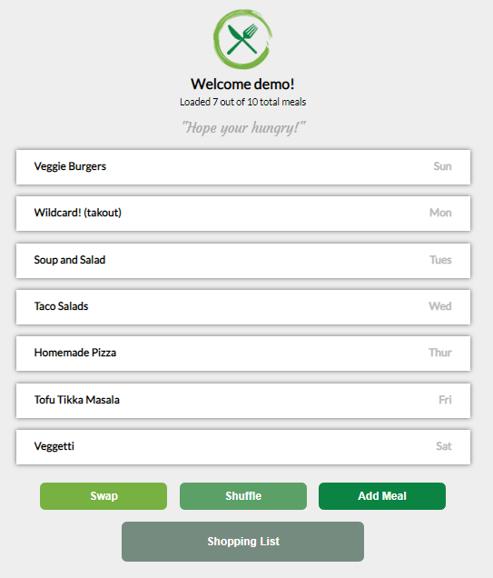

# Meal Planner

#### GitHub: https://github.com/allenjwelch/meal_planner
#### Heroku: https://react-meal-planner.herokuapp.com/

## Description:
Taking the thought out of planning what's for dinner. An evening meal planning CRUD application where users can sign in, add their favorite meals to their collection, and get a randomized schedule of their meals. Once their schedule is generated they can shuffle their whole week or just swap individual days. Users' login dates are saved and read to ensure a new random selection of meals is generated each week. Users can also use the 'Shopping List' button to get a quick glimpse of their week's meals complete with their full list of ingredients.
* Use login username: _demo_, password: _demo_ to try it out!

## Prerequisites / Dependencies
To duplicate you will need the following things properly installed on your computer.
* [Git](http://git-scm.com/)
* [Express.js](https://expressjs.com/)
* [React.js](https://reactjs.org/)
* [Node.js](http://nodejs.org/)
  - body-parser

## Installation
* `git clone <repository-url>` this repository
* change into the new directory
* `npm install`

## Running / Development
* npm start (to start development server)

